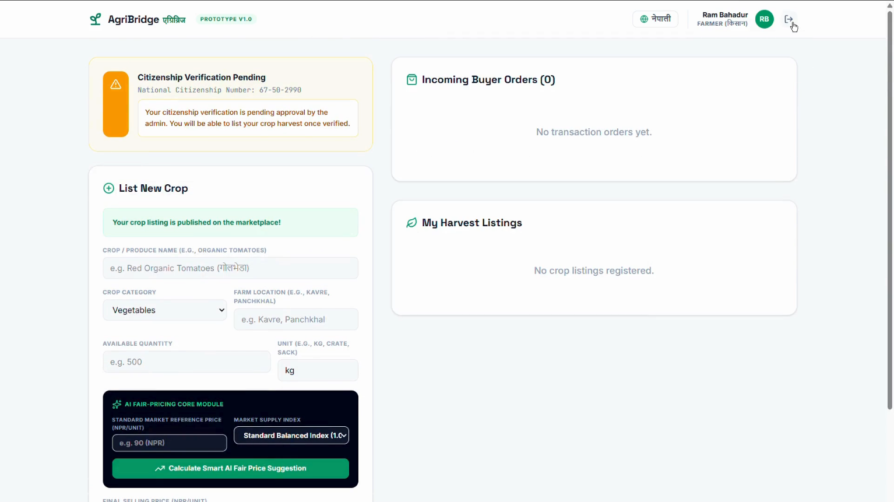
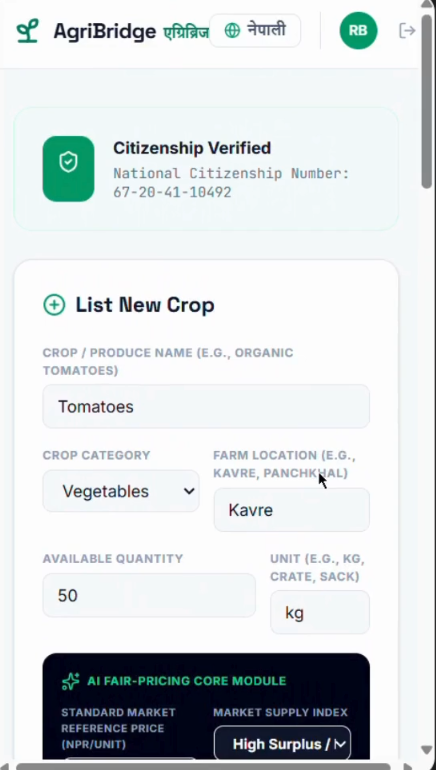
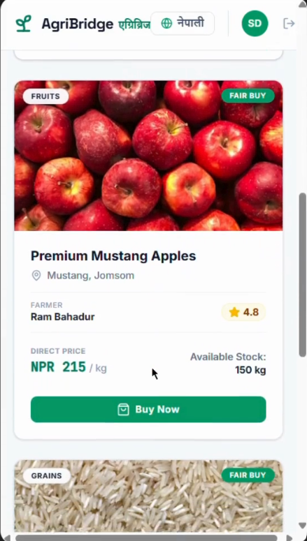
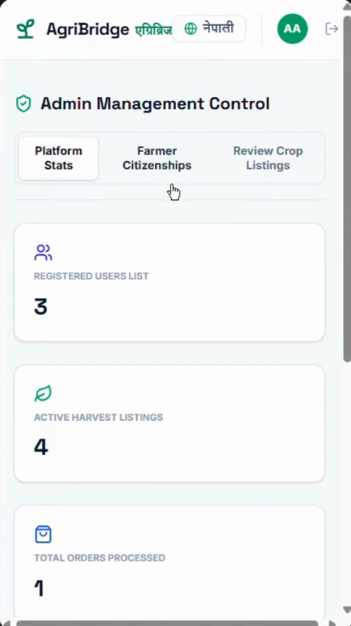
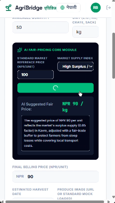

# AgriBridge

A farm-to-table marketplace connecting farmers directly with buyers. It helps in cutting out the disadvantaged middleman layers that leave farmers underpaid and buyers overcharged. Built for Kathmandu Valley, works on desktop and mobile, in English and Nepali.
 
Displayed below are the system view:

  
  
  
  
  

## Features

- **Marketplace** :farmers list produce, buyers order directly
- **AI fair pricing** :LightGBM predicts fair prices from market data
- **Delivery integration** :from farm to doorstep
- **Two-way ratings** :for farmer and buyer implements trust on both sides
- **Roles** — Buyer, Farmer and Admin 

